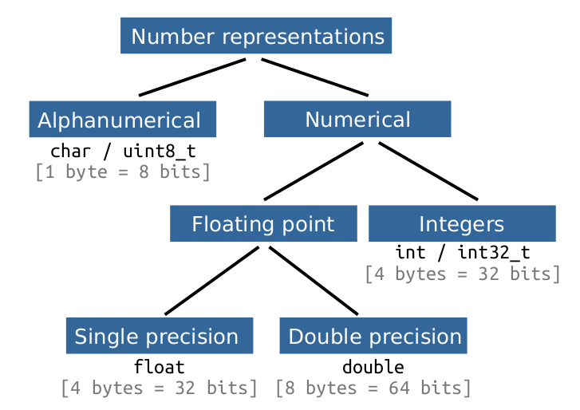
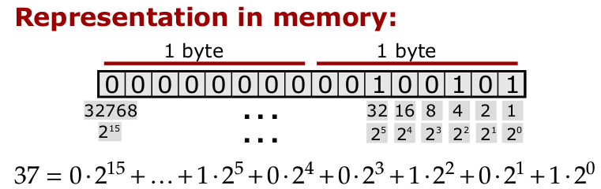
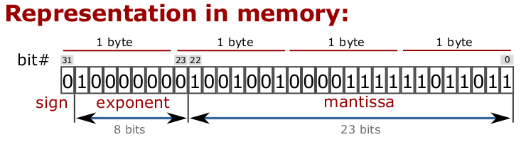

## Course 06 Modern C++: Static, Numbers, Arrays, Non-owning pointers, Classes
This is a learning notebook for this Modern C++ course from Dr. Igor Bogoslavskyi. Many many thanks to his excellent [lectures](https://www.youtube.com/playlist?list=PLgnQpQtFTOGR50iIOtO36nK6aNPtVq98C)!:thumbsup::thumbsup:

### 1. Static variables and methods

Static member variables of a class
* Exist exactly once per class, not per object
* The value is equal across all instances
* Must be defined in *.cpp files

Static member functions of a class
* Do not have an object of a class
* Can access private members but need an object
* Syntax for calling:

```
ClassName::MethodName(<params>)
```

#### static variables
```
class Counted {
public:
    Counted() {Counted::count++;}    
    ~Counted() {Counted::count--;}

    static int count;
};

int Counted::count = 0;  // definition
```

#### static member functions

```
 #include <iostream>

class Point {
public:
	Point(int x, int y)
		: x_(x), y_(y) {}

	static float dist(const Point& a, const Point& b) {
		int diff_x = a.x_ - b.x_;
		int diff_y = a.y_ - b.y_;
		return sqrt(diff_x*diff_x + diff_y*diff_y);
	}	

private:
	int x_ = 0;
	int y_ = 0;
};

int main()
{
	Point a(2,2), b(1,1);
	std::cout << "Distance is " << Point::dist(a,b) << std::endl;

	return 0;
}
```

### 2. Recalling variable declaration

```
int x = 1;
float y = 1.1313f;
```
#### How is the number represented in the memory?

<p align = "center">
  
</p>
[Figure refers to lecture 06 slides]


#### How much memory does a type need?
Get number of bytes for a type:
```
sizeof(<type>)
```

#### Representing integer types

```
#include <iostream>

int main() {
    unsigned short int k = 37;
    std::cout << "sizeof("<< k <<") is " << sizeof(k)
              << " bytes or " << sizeof(k) * 8 << " bits." 
              << std::endl;

    return 0;
}
```
<p align = "center">
  
</p>

[Figure refers to lecture 06 slides]


#### Floating point numbers

```
#include <iostream>

int main() {
    float k = 3.14159;
    std::cout << "sizeof("<< k <<") is " << sizeof(k)
              << " bytes or " << sizeof(k) * 8 << " bits." 
              << std::endl;

    return 0;
}
```

<p align = "center">
  
</p>

[Figure refers to lecture 06 slides]

#### float vs. double
* Same representation as float
* double takes 8 bytes instead of 4 for float
* Longer Exponent and Mantissa
    * Exponent=11 Bits instead of 8 for float
    * Mantissa=53 Bits instead of 23 for float

 
### 3. Pointers

* Always initialize with a value or a nullptr
* Dereferencing a nullptr causes a Segmentation Fault
* Use if to avoid Segmentation Faults

```
if(some_ptr) {
    // only enters if some_ptr != nullptr
}

if(!some_ptr) {
    // only enters if some_ptr == nullptr
}
```
Careful! Overflow! 
