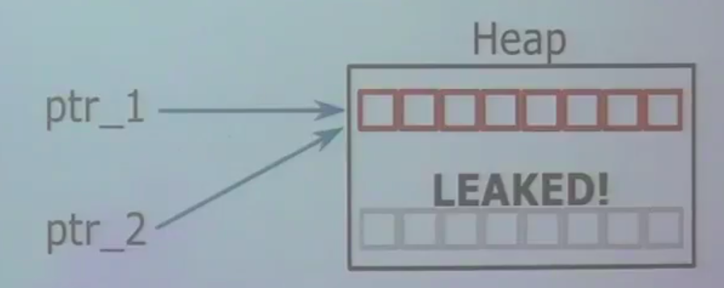

## Course 07 Modern C++: Pointers, const with pointers, Stack and Heap, Memory leaks
This is a learning notebook for this Modern C++ course from Dr. Igor Bogoslavskyi. Many many thanks to his excellent [lectures](https://www.youtube.com/playlist?list=PLgnQpQtFTOGR50iIOtO36nK6aNPtVq98C)!:thumbsup::thumbsup:

### 1. Using pointers for classes

#### Referencing and Dereferencing
* Pointers can point to objects of custom classes:

```
std::vector<int> vector_int;
std::vector<int>* vec_ptr = &vector_int;
MyClass obj;
MyClass* obj_ptr = &obj;
```

* Call object function from pointer with ->

```
MyClass obj;
obj.MyFunc();
MyClass* obj_ptr = &obj;
obj_ptr->MyFunc();
```

* obj->Func() === (*obj).Func()

#### Pointers are polymorphic
* Pointers are just like references, but have additional useful properties:
  * Can be reassigned
  * Can point to "nothing" nullptr
  * Can be stored in a vector or an array

* Use pointers for polymorphism

```
Derived derived;
Base* ptr = &derived;
```

* Example: for implementing strategy store a pointer to the strategy interface and initialize it with nullptr and check if it is set before calling its methods

```
class AbstractShape {
public:
    virtual void Print() const = 0;
};

class Square : public AbstractShape {
public:
    void Print() const override {
        std::cout << "Square" << std::endl;
    }
};

class Triangle : public AbstractShape {
public:
    void Print() const override {
        std::cout << "Triangle" << std::endl;
    }    
};

int main() {
    std::vector<AbstractShape*> shapes;
    Square square;
    Triangle triangle;
    shapes.push_back(&square);
    shapes.push_back(&triangle);

    for(const auto shape : shapes) {
        shape->Print();
    }
    return 0;
}
```

So if we have a function that takes a lot of shapes then we can just pass to it some abstract shapes and we don't care who creates them and how they create them as soon as they conform to the same interface. It is a very powerful tool for designing programs that are decoupled like where modules are decoupled from each other.

#### this pointer

* Every object of a class or a struct holds a pointer for itself

* This pointer is called _this_

* Allows the objects to:
  * Return a reference to themselves: return *this;
  * Create copies of themselves within a function
  * Explicitly show that a member belongs to the current object: this->x();

#### Using const with pointers

* Pointers can point to a const variable:(I care about my variable not being changed, but I don't care if somebody change the pointer to something else, because he will be working with a copy of my pointer.)
 
```
// cannot change value, can reassign pointer
const MyType* const_var_ptr = &var;
const_var_ptr = &var_other;
```


* Pointers can be const:
```
// cannot reassign pointer, can change value
MyType* const var_const_ptr = &var;
var_const_ptr->a = 10;
```

* Pointers can do both at the same time:
```
// cannot change in any way, read-only
const MyType* const const_var_const_ptr = &var;
```

* Read from right to left to see which const refers to what


### 2. Memory management structures
Working memory is divided into two parts: stack and heap. 

#### Stack memory
* Static memory
* Available for short term storage (scope)
* Small/limited (8 MB Linux typical)
* Memory allocation is fast
* LIFO structure
* Items added to top pf the stack with push
* Items removed from the top with pop


```
#include <iostream>

int main() {
  int size = 2;
  int* ptr = nullptr;
  {
    int ar[size];
    ar[0] = 42;
    ar[1] = 13;
    ptr = ar;
  }

  for (int i = 0;i < size; i++) {
    std::cout << ptr[i] << std::endl;
  }
  
  return 0;
}
```


#### Heap memory
Whenever you use a string, or a vector, it's just a class that allocates memory on the heap, you don't know about it, but it does it for you. 

* Dynamic memory
* Available for long time
* Raw modifications possible with new and delete
* Allocation is slower than stack allocations

```
#include <iostream>

int main() {
  int size = 2;
  int* ptr = nullptr;
  {
    ptr = new int[size];
    ptr[0] = 42;
    ptr[1] = 13;
  }

  for (int i = 0;i < size; i++) {
    std::cout << ptr[i] << std::endl;
  }
  delete[] ptr;

  for(int i = 0; i < size; i++) {
    std::cout << ptr[i] << std::endl;
  }

  return 0;
}
```

#### Memory leak
Memory leak is some memory that is allocated on the heap that we lost access to, the issue is that we cannot find anything that we don't hold an address to, we don't know, we don't have a magic function that tells us what does our program use on a heap, we have to manage that ourselves. 

<p align = "center">
  
</p>

[Figure refers to Igor's lecture video]

Error: double free or corruption


#### RAII

* Resource Allocation Is Initialization
* New object -> allocate memory
* Remove object -> free memory
* Object own their data

```
class MyClass {
public:
  MyClass() { data_ = new SomeOtherClass;}
  ~MyClass() {
    delete data_;
    data_ = nullptr;
  }  

private:
  SomeOtherClass* data_;
};
```

* Still cannot copy an object of MyClass!

```
int main()
{
  MyClass a;
  MyClass b(a);

  return 0;
}
```
Then, like this
*** Error in 'xxx' :
doube free or corruption: ox0000000000872d80 ***


#### Shallow vs deep copy

* shallow copy: just copy pointers, not data
* deep copy: copy data, create new pointers
* default copy constructor and assignment operator implement shallow copying
* RAII + shallow copy -> dangling pointer
* RAII + Rule of All Or Nothing -> correct
* Use smart pointers instead!

> In RAII, holding a resource is a class invariant, and is tied to object lifetime: resource allocation (or acquisition) is done during object creation (specifically initialization), by the constructor, while resource deallocation (release) is done during object destruction (specifically finalization), by the destructor. In other words, resource acquisition must succeed for initialization to succeed. Thus the resource is guaranteed to be held between when initialization finishes and finalization starts (holding the resources is a class invariant), and to be held only when the object is alive. Thus if there are no object leaks, there are no resource leaks. -- wiki


#### Smart pointers
* Smart pointers wrap a raw pointer into a class and manage its lifetime(RAII)

* Smart pointers are all about ownership

* Always use smart pointers when the pointer should own heap memory

* Still use raw pointers for non-owning pointers and simple address storing

* focus on 2 types of smart pointers:
  * std::unique_ptr
  * std::shared_ptr
